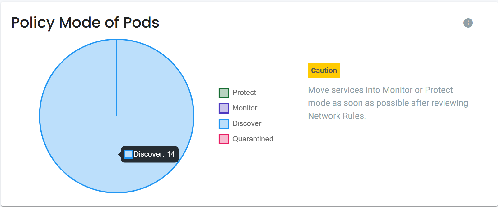

## NVSHAS-9671 Evaluate loading time on the main dashboard page (lower section)

### APIs used in the dashboard page

```
1️⃣ /v1/scan/config
2️⃣ /v1/workload?view=pod<&f_domain=namespace>
3️⃣ /v1/host?start=0&limit=0<&f_domain=namespace>
4️⃣ /v1/group?view=pod&scope=local<&f_domain=namespace>
5️⃣ /v1/policy/rule<?f_domain=namespace>
6️⃣ /v1/conversation<?f_domain=namespace>
```

### APIs payload - 1️⃣ /v1/scan/config

```
{
  "config": {
    "auto_scan": true
  }
}
```

### APIs payload - 2️⃣ /v1/workload

<details><summary>Dashboard part</summary>
<p align="left">

</p>
</details>

It returns workloads array.

```
{
  "workloads": []
}
```

<details><summary>One workload payload</summary>

```
{
      "applications": [],
      "author": "",
      "baseline_profile": "zero-drift",
      "cap_change_mode": true,
      "cap_quarantine": true,
      "cap_sniff": true,
      "children": [],
      "cpus": "",
      "created_at": "2024-11-15T04:21:13Z",
      "display_name": "cattle-cleanup-job--1-mqdbt",
      "domain": "default",
      "enforcer_id": "35f5b7af089514ea45e16efef3351ea94f413a7dac389c8458601e5ae2972b5c",
      "enforcer_name": "neuvector-enforcer-pod-g2hrm",
      "exit_code": 0,
      "finished_at": "",
      "has_datapath": true,
      "host_id": "ubuntu2204-A:J34I:M2CR:RM54:Z24R:HRMR:2DLN:ISHL:2AVY:FW63:SAKO:KEBW:33IO",
      "host_name": "ubuntu2204-A",
      "id": "2426ae02f5f3781f87d2eee18504df65c02fda9fe4a13b189d0279f92f0e6347",
      "image": "k8s.gcr.io/pause:3.4.1",
      "image_created_at": "2021-01-13T04:24:21Z",
      "image_id": "0f8457a4c2ecaceac160805013dc3c61c63a1ff3dee74a473a36249a748e0253",
      "image_reg_scanned": false,
      "interfaces": {
        "eth0": [
          {
            "gateway": "",
            "ip": "10.32.0.23",
            "ip_prefix": 12
          }
        ]
      },
      "labels": {
        "annotation.kubernetes.io/config.seen": "2024-11-14T20:21:13.273401483-08:00",
        "annotation.kubernetes.io/config.source": "api",
        "controller-uid": "9e36113d-ca71-49d5-b7b9-6a7b7ebc6bc4",
        "io.kubernetes.container.name": "POD",
        "io.kubernetes.docker.type": "podsandbox",
        "io.kubernetes.pod.name": "cattle-cleanup-job--1-mqdbt",
        "io.kubernetes.pod.namespace": "default",
        "io.kubernetes.pod.uid": "ce69c1b6-ac2e-4fd4-8b32-c56d66581e2b",
        "job-name": "cattle-cleanup-job"
      },
      "memory_limit": 0,
      "name": "k8s_POD_cattle-cleanup-job--1-mqdbt_default_ce69c1b6-ac2e-4fd4-8b32-c56d66581e2b_0",
      "network_mode": "none",
      "platform_role": "",
      "pod_name": "cattle-cleanup-job--1-mqdbt",
      "policy_mode": "Discover",
      "ports": [],
      "privileged": false,
      "profile_mode": "Discover",
      "run_as_root": true,
      "running": true,
      "scan_summary": {
        "base_os": "",
        "cvedb_create_time": "2024-09-18T00:40:11Z",
        "high": 0,
        "medium": 0,
        "result": "succeeded",
        "scanned_at": "2024-12-11T00:22:14Z",
        "scanned_timestamp": 1733876534,
        "scanner_version": "3.559",
        "status": "finished"
      },
      "secured_at": "2024-11-15T04:24:01Z",
      "service": "cattle-cleanup-job-.default",
      "service_account": "",
      "service_group": "nv.cattle-cleanup-job-.default",
      "service_mesh": false,
      "service_mesh_sidecar": false,
      "started_at": "2024-11-15T04:21:19Z",
      "state": "discover"
    }
```

</details>

### APIs payload - 3️⃣ /v1/host?start=0

<details><summary>Dashboard part</summary>
<p align="left">

</p>
</details>

It returns hosts array.

```
{
  "hosts": []
}
```

<details><summary>One host payload</summary>

```
 {
      "annotations": null,
      "cap_docker_bench": true,
      "cap_kube_bench": true,
      "cgroup_version": 2,
      "containers": 41,
      "cpus": 8,
      "docker_bench_status": "finished",
      "id": "ubuntu2204-A:J34I:M2CR:RM54:Z24R:HRMR:2DLN:ISHL:2AVY:FW63:SAKO:KEBW:33IO",
      "interfaces": {
        "ens192": [
          {
            "gateway": "",
            "ip": "10.1.45.40",
            "ip_prefix": 16
          }
        ]
      },
      "kernel": "5.15.0-78-generic",
      "kube_bench_status": "finished",
      "labels": null,
      "memory": 12537417728,
      "name": "ubuntu2204-A",
      "os": "Ubuntu 22.04 LTS",
      "platform": "Kubernetes",
      "pods": 20,
      "policy_mode": "Discover",
      "profile_mode": "Discover",
      "runtime": "docker",
      "runtime_api_version": "1.41",
      "runtime_version": "20.10.16",
      "scan_summary": {
        "base_os": "ubuntu:22.04",
        "cvedb_create_time": "2024-09-18T00:40:11Z",
        "high": 2058,
        "medium": 7687,
        "result": "succeeded",
        "scanned_at": "2024-12-11T00:25:22Z",
        "scanned_timestamp": 1733876722,
        "scanner_version": "3.559",
        "status": "finished"
      },
      "state": "connected",
      "storage_driver": "overlay2"
    }
```

</details>

### APIs payload - 4️⃣ /v1/group

<details><summary>Dashboard part</summary>
<p align="left">

</p>
</details>

It returns groups array.

```
{
  "groups": []
}
```

<details><summary>One group payload</summary>

```

    {
      "baseline_profile": "basic",
      "cfg_type": "learned",
      "comment": "",
      "creater_domains": null,
      "criteria": [],
      "domain": "",
      "kind": "node",
      "learned": true,
      "members": [
        {
          "author": "",
          "baseline_profile": "",
          "cap_change_mode": true,
          "cap_quarantine": false,
          "cap_sniff": false,
          "children": null,
          "display_name": "",
          "domain": "",
          "has_datapath": false,
          "host_id": "",
          "host_name": "",
          "id": "ubuntu2204-C:BW54:QWBZ:GOKY:BH37:27FH:ZMG6:SHQ4:UXIZ:SQXM:TSDT:GQBB:YQY6",
          "image": "",
          "image_created_at": "",
          "image_id": "",
          "image_reg_scanned": false,
          "name": "ubuntu2204-C",
          "platform_role": "",
          "pod_name": "",
          "policy_mode": "",
          "privileged": false,
          "profile_mode": "",
          "run_as_root": false,
          "scan_summary": {
            "base_os": "ubuntu:22.04",
            "cvedb_create_time": "2024-09-18T00:40:11Z",
            "high": 2042,
            "medium": 7638,
            "result": "succeeded",
            "scanned_at": "2024-12-11T00:22:14Z",
            "scanned_timestamp": 1733876534,
            "scanner_version": "3.559",
            "status": "finished"
          },
          "service": "nodes",
          "service_group": "nodes",
          "service_mesh": false,
          "service_mesh_sidecar": false,
          "state": "connected"
        },
        {
          "author": "",
          "baseline_profile": "",
          "cap_change_mode": true,
          "cap_quarantine": false,
          "cap_sniff": false,
          "children": null,
          "display_name": "",
          "domain": "",
          "has_datapath": false,
          "host_id": "",
          "host_name": "",
          "id": "ubuntu2204-B:SGC3:5QOQ:EVL4:WLO5:MP2D:SESI:KF2R:T6UF:OZ7V:IJFT:IGBI:JAMU",
          "image": "",
          "image_created_at": "",
          "image_id": "",
          "image_reg_scanned": false,
          "name": "ubuntu2204-B",
          "platform_role": "",
          "pod_name": "",
          "policy_mode": "",
          "privileged": false,
          "profile_mode": "",
          "run_as_root": false,
          "scan_summary": {
            "base_os": "ubuntu:22.04",
            "cvedb_create_time": "2024-09-18T00:40:11Z",
            "high": 2036,
            "medium": 7634,
            "result": "succeeded",
            "scanned_at": "2024-12-11T00:23:13Z",
            "scanned_timestamp": 1733876593,
            "scanner_version": "3.559",
            "status": "finished"
          },
          "service": "nodes",
          "service_group": "nodes",
          "service_mesh": false,
          "service_mesh_sidecar": false,
          "state": "connected"
        },
        {
          "author": "",
          "baseline_profile": "",
          "cap_change_mode": true,
          "cap_quarantine": false,
          "cap_sniff": false,
          "children": null,
          "display_name": "",
          "domain": "",
          "has_datapath": false,
          "host_id": "",
          "host_name": "",
          "id": "ubuntu2204-A:J34I:M2CR:RM54:Z24R:HRMR:2DLN:ISHL:2AVY:FW63:SAKO:KEBW:33IO",
          "image": "",
          "image_created_at": "",
          "image_id": "",
          "image_reg_scanned": false,
          "name": "ubuntu2204-A",
          "platform_role": "",
          "pod_name": "",
          "policy_mode": "",
          "privileged": false,
          "profile_mode": "",
          "run_as_root": false,
          "scan_summary": {
            "base_os": "ubuntu:22.04",
            "cvedb_create_time": "2024-09-18T00:40:11Z",
            "high": 2058,
            "medium": 7687,
            "result": "succeeded",
            "scanned_at": "2024-12-11T00:25:22Z",
            "scanned_timestamp": 1733876722,
            "scanner_version": "3.559",
            "status": "finished"
          },
          "service": "nodes",
          "service_group": "nodes",
          "service_mesh": false,
          "service_mesh_sidecar": false,
          "state": "connected"
        }
      ],
      "name": "nodes",
      "not_scored": false,
      "platform_role": "",
      "policy_mode": "Discover",
      "policy_rules": [
        10001,
        10005,
        10006,
        10017,
        10019,
        10020
      ],
      "profile_mode": "Discover",
      "reserved": true,
      "response_rules": []
    }

```

</details>

### APIs payload - 5️⃣ /v1/policy/rule

<details><summary>Dashboard part</summary>
<p align="left">

</p>
</details>

It returns rules array.

```
{
  "rules": []
}
```

<details><summary>One rule payload</summary>

```
 {
      "action": "allow",
      "applications": [
        "any"
      ],
      "cfg_type": "learned",
      "comment": "",
      "created_timestamp": 1732583065,
      "disable": false,
      "from": "nodes",
      "id": 10001,
      "last_modified_timestamp": 1732583065,
      "learned": true,
      "ports": "tcp/6783,tcp/6784",
      "priority": 0,
      "to": "nv.weave-net.kube-system"
    }
```

</details>

### APIs payload - 6️⃣ /v1/conversation

<details><summary>Dashboard part</summary>
<p align="left">

</p>

<p align="left">

</p>
</details>

It returns conversations array.

```
{
  "conversations": []
}
```

<details><summary>One conversation payload</summary>

```
    {
      "applications": [],
      "bytes": 41310313,
      "entries": [
        {
          "bytes": 41310313,
          "client_ip": "10.32.0.6",
          "policy_action": "open",
          "port": "tcp/443",
          "server_ip": "10.96.0.1",
          "sessions": 0
        }
      ],
      "event_type": [],
      "from": "ea7cd42bb174431d18aefd94715ec983463c3312b2d2c17e6d1b71d22be6c59d",
      "policy_action": "open",
      "ports": [
        "tcp/443"
      ],
      "protocols": [
        "tcp"
      ],
      "sessions": 0,
      "severity": "",
      "to": "nv.ip.kubernetes.default"
    }
```

</details>
