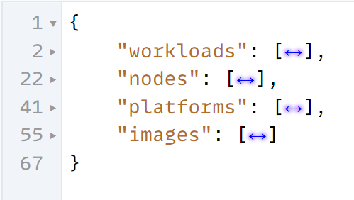
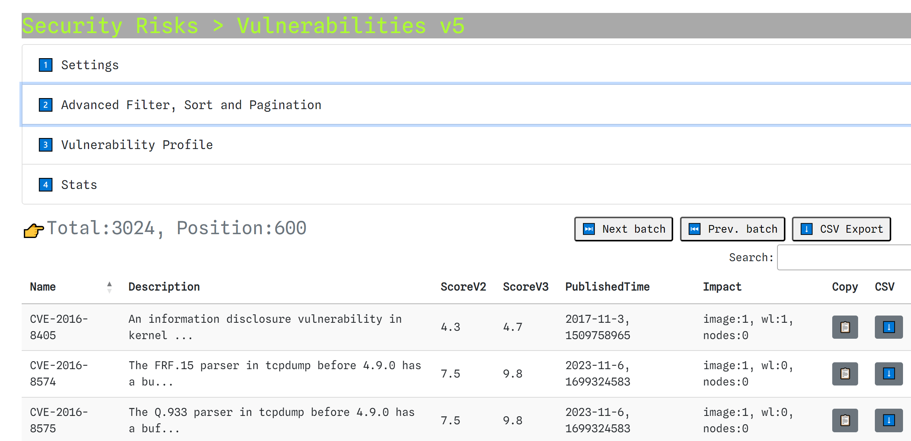

## Vulnerablity Page changes (v2)

### History
- v1 - 2023/12/13  
- v2 - 2023/12/17  

## Table of Contents

- [Usage for `v1/vulasset`](#usage-for-v1vulasset)
    - [Starting a Query Session](#starting-a-query-session)
    - [Navigating Within a Query Session](#navigating-within-a-query-session)
- [Usage for `v1/assetvul`](#usage-for-v1assetvul)
- [Testing Environment](#testing-environment)

## Endpoints
The endpoint name can be updated to enhance clarity. 

```
v1/vulasset     // for main UI
v1/assetvul     // for Asset Views (the PDF printout)
```

## Usage for `v1/vulasset`

To utilize the v1/vulasset feature, begin by initiating a query session through the submission of advanced filters and sorting options. The backend will generate a session specific to the provided query and furnish you with a token for navigating within that session. If a user modifies the filter criteria, it is essential to initiate a new query session.

### Starting a Query Session

To initiate a query, use the POST method on the endpoint `/v1/vulasset`, providing advanced filters and sorting options within the request body. 

```
HTTP POST v1/vulasset

Request Body
{
    "publishedType": "before",      // all, before, after
    "publishedTime": 1605353432,    // timetick
    "packageType": "withfix",       // all, withfix, withoutfix
    "severityType": "high",         // high, medium
    "scoreType": "v3",              // v2, v3
    "scoreV3Min": 1,
    "scoreV3Max": 4,

    "matchTypeService": "contains", // contains, equals
    "serviceName": "svc",      

    "matchTypeNs": "contains",
    "selectedDomains": [
        "ns1",
        "ns7"
    ],
    "matchTypeImage": "equals",     // contains, equals
    "imageName": "img",         

    "matchTypeNode": "equals",      // contains, equals
    "nodeName": "node",

    "matchTypeContainer": "equals", // contains, equals
    "containerName": "cont",

    "orderbycolumn": "scorev3",     // name, scorev2, scorev3, publishedtime
    "orderby": "desc",

    "viewType": "all",              // 👈 all, containers, infrastructure, registry (as of 2023/12/18, this implementation is not ready yet.)
}

Response Body
{
    "debug_error": 0,    // please ignore fields start with "debug".
    "debug_error_message": "",
    "debug_perf_stats": [
        "step-1, get allowed resources, took=792.405µs",
        ...
    ],
    "query_token": "eff501a8ce17",   👈  // need to bring this value in the URL parameter to navigate this query session
    "summary": {      
        "count_distribution": {   1️⃣
            "high": 20,     // In the searched result, 
            "low": 10,      //   how many distinct CVEs has high severity (based on the score type, v2 or v3)
            "medium": 15,   // 

            "container": 3, // In the searched result, how many distinct CVEs has container impact.
            "image": 8,     //  .... has image impact.
            "node": 12,     //  .... has node impact.
            "platform": 5   //  .... has platform impact.
        },
        "top_images": [           2️⃣
            {
                "display_name": "Image1",
                "high": 5,
                "id": "0",
                "low": 2,
                "medium": 3
            }
            ...
        ],
        "top_nodes": [              3️⃣
            {
                "display_name": "Node1",
                "high": 8,
                "id": "0",
                "low": 2,
                "medium": 4
            },
            ...
        ]
    },
    "total_matched_records": 161,   👈
    "total_records": 279            👈
}
```

### Navigating Within a Query Session

To navigate within an existing search session, make an `HTTP GET` request to the same endpoint (`/v1/vulasset`) with the following query parameters. 

Refer to the detailed fields and their corresponding values in the following raw data section.

```
GET v1/vulasset?token=eff501a8ce17&start=0&row=100

1️⃣ token: Indicates the query session; you can find this token in the response body.
2️⃣ start: Specifies the starting row.
3️⃣ row: Defines the number of rows to fetch. Use -1 to fetch all rows.

Reponse
{
    "vulnerabilities": [
        {
            "description": "Docker before 1.5 allows local users to have unspecified impact via vectors involving unsafe /tmp usage.",
            "images": [
                {
                    "display_name": "wurstmeister-zookeeper:latest",
                    "domains": null,
                    "id": "dc00f1198a444104617989bde31132c22d7527c65e825b9de4bbe6313f22637f",
                    "policy_mode": ""
                }
            ],
            "last_modified_timestamp": 1507923932,
            "link": "http://people.ubuntu.com/~ubuntu-security/cve/CVE-2014-0047",
            "name": "CVE-2014-0047",
            "nodes": [
                {
                    "display_name": "ubuntu2204-A",
                    "domains": [],
                    "id": "ubuntu2204-A:J34I:M2CR:RM54:Z24R:HRMR:2DLN:ISHL:2AVY:FW63:SAKO:KEBW:33IO",
                    "policy_mode": "Discover"
                },
                {
                    "display_name": "ubuntu2204-B",
                    "domains": [],
                    "id": "ubuntu2204-B:SGC3:5QOQ:EVL4:WLO5:MP2D:SESI:KF2R:T6UF:OZ7V:IJFT:IGBI:JAMU",
                    "policy_mode": "Discover"
                },
                {
                    "display_name": "ubuntu2204-C",
                    "domains": [],
                    "id": "ubuntu2204-C:BW54:QWBZ:GOKY:BH37:27FH:ZMG6:SHQ4:UXIZ:SQXM:TSDT:GQBB:YQY6",
                    "policy_mode": "Discover"
                }
            ],
            "packages": {
                "docker.io": [
                    {
                        "fixed_version": "1.6.2~dfsg1-1ubuntu4~14.04.1",
                        "package_version": "1.0.1~dfsg1-0ubuntu1~ubuntu0.14.04.1"
                    }
                ]
            },
            "platforms": [],
            "published_timestamp": 1507923932,
            "score": 4.6,
            "score_v3": 7.8,
            "severity": "High",
            "vectors": "AV:L/AC:L/Au:N/C:P/I:P/A:P",
            "vectors_v3": "CVSS:3.0/AV:L/AC:L/PR:L/UI:N/S:U/C:H/I:H/A:H",
            "workloads": [
                {
                    "display_name": "wurstmeister",
                    "domains": [
                        "default"
                    ],
                    "id": "d3ecf62b28ec00259f46041311fb9ea7231c6ae673b37ddb98ae0e71493de2ca",
                    "image": "quay.io/nvlab/wurstmeister-zookeeper:latest",
                    "policy_mode": "Discover",
                    "service": "my-dep1.default"
                }
            ]
        }
    ]
}
```

## Usage for `v1/assetvul`

This endpoint is dedicated to serving printouts of the Assets View, presenting vulnerability data associated with a particular asset.

No pagination functionality is required for this endpoint. It is specifically implemented for generating printouts, and therefore, the entire content can be retrieved in a single request.

### The request

Use `HTTP POST` for this request.
The majority fields is the same as in `v1/vulasset` with one additional for `lastModifiedTime`.  

```
HTTP POST v1/vulasset

Request Body
{
    "publishedType": "before",      // all, before, after
    "publishedTime": 1605353432,    // timetick
    "packageType": "withfix",       // all, withfix, withoutfix
    "severityType": "high",         // high, medium
    "scoreType": "v3",              // v2, v3
    "scoreV3Min": 1,
    "scoreV3Max": 4,

    "matchTypeService": "contains", // contains, equals
    "serviceName": "svc",      

    "matchTypeNs": "contains",
    "selectedDomains": [
        "ns1",
        "ns7"
    ],
    "matchTypeImage": "equals",     // contains, equals
    "imageName": "img",         

    "matchTypeNode": "equals",      // contains, equals
    "nodeName": "node",

    "matchTypeContainer": "equals", // contains, equals
    "containerName": "cont",

    "lastModifiedTime":             // 1605353432   👈 (as of 2023/12/18, this implementation is not ready yet.)
}
```

### The response

The response from this API call contains all the necessary data in a single retrieval, as it is intended for the printout function.

The response strucutre like this.
<p align="left">

</p>

```
{
    "workloads": [
        {
            "name": "kube-proxy-84bkd",
            "domain": "kube-system",
            "applications": [
                "TCP/10249",
                "TCP/10256"
            ],
            "policy_mode": "Discover",
            "service_group": "nv.kube-proxy.kubesystem",
            "high": 12,
            "medium": 5,
            "low": 2,
            "vulnerabilities": [
                "CVE-2023-29383",
                "CVE-2022-4899"
            ],
            "scanned_at": "2023-12-11T01:21:10Z"
        }
    ],
    "nodes": [
        {
            "name": "master",
            "os": "Ubuntu 22.04 LTS",
            "kernel": "5.15.0-71-generic",
            "cpus": 4,
            "memory": 8335712256,
            "containers": 16,
            "policy_mode": "Discover",
            "high": 12,
            "medium": 5,
            "low": 2,
            "vulnerabilities": [
                "CVE-2023-29383",
                "CVE-2022-4899"
            ],
            "scanned_at": "2023-12-11T01:21:10Z"
        }
    ],
    "platforms": [
        {
            "name": "Kubernetes",
            "version": "1.23.17",
            "base_os": "",
            "high": 12,
            "medium": 5,
            "low": 2,
            "vulnerabilities": [
                "CVE-2023-29383",
                "CVE-2022-4899"
            ]
        }
    ],
    "images": [
        {
            "name": "gcr.io/google-samples/microservices-demo/adservice:v0.5.0",
            "high": 12,
            "medium": 5,
            "low": 2,
            "vulnerabilities": [
                "CVE-2023-29383",
                "CVE-2022-4899"
            ]
        }
    ]
}
```


## Testing environment
I have set up an environment in the lab at 10.1.45.44. I will update the image with the latest work for testing purposes.

To access the management console, visit https://10.1.45.44:30590/#/login.
If necessary, you can also SSH into the machine to make any required changes.
The controller endpoint is accessible via curl at 10.1.45.44:31693.

You can also use these two scripts on 10.1.45.44 for testing.

### Sample test page

I also has a testing page, visit https://10.1.45.44:30161/portal/vp5.html

<p align="left">

</p>


### `/v1/vulasset`
```
neuvector@ubuntu2204-E:~/ui_perf$ cat c_new_vulasset_step1_POST.sh
...
curl -X POST -k -H "Content-Type: application/json" -H "X-Auth-Token: $TOKEN" -d @scanasset5.json "https://$K8sNodeIP:$ControllerSvcPORT/v1/vulasset"

neuvector@ubuntu2204-E:~/ui_perf$ ./c_new_vulasset_step1_POST.sh
{ ..... "query_token":"mm_ec1ab4a190d0" 👈 ,"summary":{"count_distribution".... ,"total_matched_records":3006,"total_records":3006}

neuvector@ubuntu2204-E:~/ui_perf$ ./d_new_vulasset_step2_GET.sh mm_ec1ab4a190d0 👈 | jq
```

### `/v1/assetvul`
```
neuvector@ubuntu2204-E:~/ui_perf$ cat e_assetvulPOST.sh
...
curl -X POST -k -H "Content-Type: application/json" -H "X-Auth-Token: $TOKEN" -d @assetvul.json "https://$K8sNodeIP:$ControllerSvcPORT/v1/assetvul"

neuvector@ubuntu2204-E:~/ui_perf$ cat assetvul.json
{
    "packageType": "all",
    "severityType": "all",
    "scoreType": "V3",
    "_publishedType": "before",
    "_publishedTime": "after",
    "_matchTypeNs": "Contains",
    "selectedDomains": [
        "ns1"
    ],
    "serviceName": "ServiceName",
    "imageName": "ImageName",
    "nodeName": "NodeName",
    "containerName": "loki",
    "_matchTypeService": "equals",
    "_matchTypeImage": "contains",
    "_matchTypeNode": "equals",
    "_matchTypeContainer": "contains",
    "scoreV3Min": 1,
    "scoreV3Max": 10,
    "lastModifiedTime": 1605353432
}


// response
{
  "images": [
    {
      "high": 9,
      "id": "0c0156a5c9e349b9fe0596db0a3846cce6de655936781386764040c6532841f3",
      "low": 0,
      "medium": 10,
      "name": "alpinedev:20230525-111504",
      "vulnerabilities": [
        "CVE-2023-0465",
        "CVE-2023-0217",
        "CVE-2022-4450",
        "CVE-2022-4304",
        "CVE-2023-0401",
        "CVE-2023-0215",
        "CVE-2023-5363",
        "CVE-2023-5678",
        "CVE-2022-4203",
        "CVE-2023-2650",
        "CVE-2023-1255",
        "CVE-2023-0216",
        "CVE-2023-0464",
        "CVE-2022-3996",
        "CVE-2023-3817",
        "CVE-2023-0466",
        "CVE-2023-3446",
        "CVE-2023-0286",
        "CVE-2023-2975"
      ]
    },
```