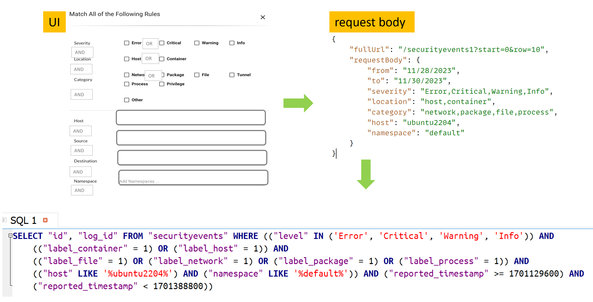

# UI Vulnerablity Page Improvement

## Table of Contents

- [Section 1: Overview](#section-1-overview)
- [Section 2: Design](#section-2-design)
- [Section 3: Security](#section-3-security)
- [Section 4: API Interface](#section-4-api-interface)
- [Section 5: Changed file and scope](5-changed-file-and-scope)

## Section 1: Overview

The primary objective is to enhance the performance of the Vulnerability Page, issues we want to address are:
- slow page load time 
- out-of-memory errors in browsers

Originally, the plan involved integrating memory reduction measures in both the Consul and Controller processes. However, after thorough exploration, we have not identified an optimal solution considering the deployment model and data synchronization. 

Consequently, this aspect will be excluded from the current release and is planned to be deferred to the subsequent version. This minimizes the system's scope and potential impacts.

## Section 2: Design

Our system utilizes SQLite as its embedded database, with each controller maintaining an database. No supplementary processes are introduced, and SQLite access is facilitated through an imported package. 

SQLite enhances our data querying capabilities, offers a file-based structure for simplified management, and contributes to system efficiency with its lightweight design.

This section introduces various design considerations, including:
- [data handling process](#data-handling-process)
- [data hook point](#data-hook-point)
- [database design](#database-design)
- [SQL](#sql)
- [multi-controller](#multi-controller)
- [session temp table](#session-temp-table)
- [session temp table cleanup](#session-temp-table-cleanup)

### data handling process

The entire data handling process is divided into three distinct phases based on timing: 
- 1️⃣ pre-process
- 2️⃣ process
- 3️⃣ post-process

<b>Pre-process</b> This phase initiates when raw data becomes available, typically following the completion of a scan report. During this stage, the data is populated into the database.

<b>Process</b> This phase is triggered when the UI requests page data. The primary objective here is to compile data specific to the query, considering variations due to user roles, filter criteria, and time. Upon completion, a temporary table is generated to store the results, and a query_token is returned to the caller. This token allows the UI to fetch data and navigate through the results.

<b>Post-process</b> This phase is activated when the UI fetches the data. To minimize tasks during the process phase, certain operations are intentionally deferred to this stage. These deferred tasks are executed when the user expresses the need to view the data.

### data hook point

The data hook point is initiated upon completion of the scan task (`func scanDone()` and `func RegistryImageStateUpdate()`). 

This hook point serves as the focal point for the Controller to establish its cache. Currently, we are extending its functionality to encompass the construction of the database.

Raw data obtained from the scan is processed through functions like `FillVulTraits()` function to generate data needed for database population. 

```
// This is called on every controller by key update
func scanDone(id string, objType share.ScanObjectType, report *share.CLUSScanReport) {
    info, ok := scanMap[id]
    info.vulTraits = scanUtils.ExtractVulnerability(report.Vuls)
    alives = vpf.FilterVulTraits(info.vulTraits, info.idns)
    highs, meds = scanUtils.GatherVulTrait(info.vulTraits)

    brief := fillScanBrief(info, len(highs), len(meds))
    info.brief = brief
    info.filteredTime = time.Now()

    vuls := scanUtils.FillVulTraits(sdb.CVEDB, baseOS, c.vulTraits, "", true)    👈
    for _, vul := range vuls {
        database3.PopulateVulAsset3(database3.TypeWorkload, c.workload.ID, vul, baseOS)  👈
    }
    database3.PopulateAssetVul(dbAssetVul)                                       👈
}
```

### database design

The database table is crafted to optimize the Vulnerability Page. This page necessitates the incorporation of two distinct aspects of data: vulnerability-based and asset-based information.

<b>tables</b>
```
CREATE TABLE vulassets (id INTEGER NOT NULL PRIMARY KEY,name TEXT,severity TEXT,description TEXT,
                    packages TEXT,link TEXT,score NUMERIC,vectors TEXT,score_v3 NUMERIC,vectors_v3 TEXT,
                    published_timestamp INTEGER, last_modified_timestamp INTEGER,
                    workloads TEXT,nodes TEXT,images TEXT,platforms TEXT,cve_sources 
                    TEXT,f_withFix INTEGER,f_profile INTEGER,debuglog TEXT)

CREATE TABLE assetvuls (id INTEGER NOT NULL PRIMARY KEY,type TEXT,assetid TEXT UNIQUE,name TEXT,
                    w_domain TEXT,w_applications TEXT,policy_mode TEXT,w_service_group TEXT,
                    cve_high INTEGER,cve_medium INTEGER,cve_low INTEGER,cve_count INTEGER,cve_lists TEXT,
                    scanned_at TEXT,n_os TEXT,n_kernel TEXT,n_cpus INTEGER,n_memory INTEGER,
                    n_containers INTEGER,p_version TEXT,p_base_os TEXT)

CREATE TABLE querystats (id INTEGER NOT NULL PRIMARY KEY,token TEXT,create_timestamp INTEGER,
                    login_type TEXT,login_id TEXT,login_name TEXT,data1 TEXT,data2 TEXT,data3 TEXT)
```

### SQL 

Within the backend, it replicate all query logic initially embedded in the front-end. This process entails translating queries received from the UI into the relevant SQL queries. 

In the current version, I prioritizes adopting direct SQL execution if the query can be seamlessly accomplished in SQL. However, if this is not feasible due to complexity or table design constraints, the system implements the necessary filtering logic in the Golang code.

The schema design encompasses considerations such as normalization levels, data modification patterns, and maintainability. In this version, I have opted for a relatively straightforward model, acknowledging the complexity of certain data and logic aspects, such as namespace checking in user roles, which is challenging to map directly. I find it more preferable to retain such logic within the Golang code and maintain it in a centralized location.

Given the context, I didn't use ORM tool to facilitate the interaction between a database and the application code by abstracting the database interactions. 

<p align="left">

</p>

I use a package `goqu` to construct SQL statement. Refer to [goqu](https://github.com/doug-martin/goqu) for details. 

Following are some code snippet show how to construct a SQL statement like this

```
SELECT "assetid", "name", "w_domain", "w_applications", "policy_mode", "w_service_group", "cve_high", 
    "cve_medium", "cve_low", "cve_lists", "scanned_at" FROM "assetvuls"
    WHERE (("type" = 'workload') AND ("assetid" IN ('7a70...','286b9...'))
    AND (("w_domain" LIKE '%kube-system%') OR ("w_domain" LIKE '%default%')))
```

```
func getWorkloadAssetView(allowed map[string]utils.Set, vulMap map[string]*DbVulAsset, queryFilter *VulQueryFilter) {
	records := make([]*api.RESTWorkloadAssetView, 0)

	columns := []interface{}{"assetid", "name", "w_domain", "w_applications", "policy_mode", "w_service_group",
							"cve_high", "cve_medium", "cve_low", "cve_lists", "scanned_at"}

	dialect := goqu.Dialect("sqlite3")

	allowedWorkloads := allowed["workloads"].ToStringSlice()
	statement, args, _ := dialect.From("assetvuls").Select(columns...)
                                 .Where(buildWhereClauseForWorkload(allowedWorkloads, queryFilter.Filters))
                                .Prepared(true).ToSQL()

	rows, err := dbHandle.Query(statement, args...)


func buildWhereClauseForWorkload(allowedID []string, queryFilter *api.VulQueryFilterViewModel) exp.ExpressionList {
    part1_assetType := goqu.Ex{
        "type": "workload",
    }

    if queryFilter.MatchType4Ns == "equals" {
        part3_domain_equals = goqu.Ex{
            "w_domain": queryFilter.SelectedDomains,
        }
    } else if queryFilter.MatchType4Ns == "contains" {

        for _, d := range queryFilter.SelectedDomains {
            domain_contains = append(domain_contains, goqu.C("w_domain").Like(fmt.Sprintf("%%%s%%", d)))
        }
    }

```

### multi-controller

Given that each controller operates independently and the database (it's embedded to the Controller process) is not shared, an essential mechanism is required to enable other controllers to construct the same session temporary table. To achieve this, a request containing user roles, advanced filters, and query_token is written to Consul. This action serves as a signal to inform other controllers. Subsequently, these controllers can utilize the provided query_token to serve requests at a later stage.

<b>Consul</b>
```
object/config/querysession/mm_fc0570a6e925
object/config/querysession/mm_fd3d6d6a87e9
```

<b>sample data</b>
```
{
    "QueryToken": "fe40e88abbf5",
    "UserAccess": {
        "Op": "write",
        "Roles": {
            "": "admin"
        },
        "WRoles": {},
        "ApiCategoryID": 5,
        "RequiredPermissions": 524360,
        "BoostPermissions": 0
    },
    "Filters": {
        "packageType": "all",
        "severityType": "all",
        "scoreType": "v3",
        ...
    }
}
```

### session temp table 

To optimize performance during the process phase, the system employs a strategic approach. The session temporary table is initially written to a memory-based database to promptly fulfill the first initial request. 

Concurrently, in the background, a file-based database is created. Once the file-based table has been successfully created, the memory-based table is deleted. This dual-step process effectively balances the imperative for rapid response times.

### session temp table cleanup

Given the dynamic nature of query results, the system employs session temporary tables for storage. Typically, a new session is unnecessary when users perform subsequent queries, such as changing filter criteria. 

To streamline resource usage, a maximum of 5 queries per user/apikey is kept. This limitation ensures that older sessions, which are no longer needed, are systematically cleaned up. 

## Section 3: Security

### SQL Injection prevention

The code uses parameterized queries, also known as prepared statements, as a best practice for writing SQL queries. 

This approach treats user input and other variables as parameters rather than integral parts of the SQL statement. By doing so, the system mitigates the risk of SQL injection attacks and ensures a more secure interaction with the database.

### File location

The database file is regenerated each time the Controller process starts under the `/tmp` folder. This recreation occurs without any modifications to the Kubernetes manifest. 

```
/ # cd /tmp/
/tmp # ls -l
total 61764
-rw-r--r--    1 root     root         12288 Dec 17 21:14 cvedb.db
drwxr-xr-x    4 root     root          4096 Dec 10 00:55 neuvector
-rw-r--r--    1 root     root      63221760 Dec 18 00:09 nvdb.db    👈
-rw-r--r--    1 root     root            15 Dec 17 21:14 ready
/tmp #
```

## Section 4: API Interface & Testing bed 

Please see [README.md](./README.md)

## Section 5: Changed file and scope