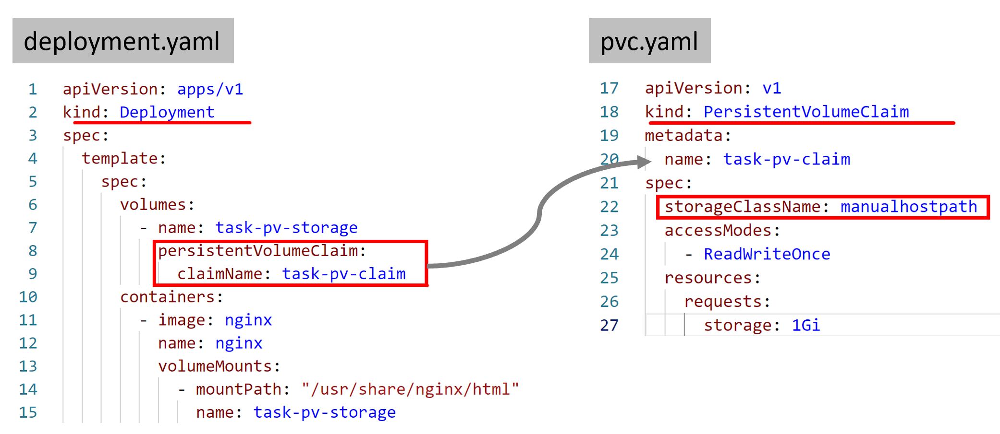
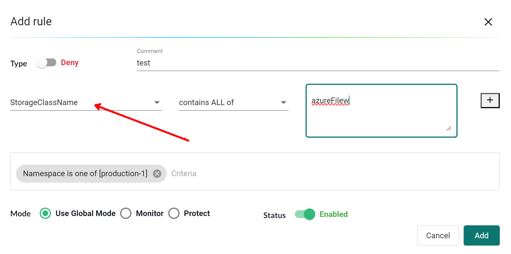
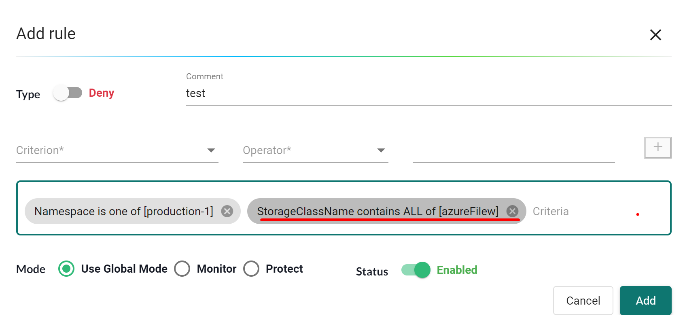
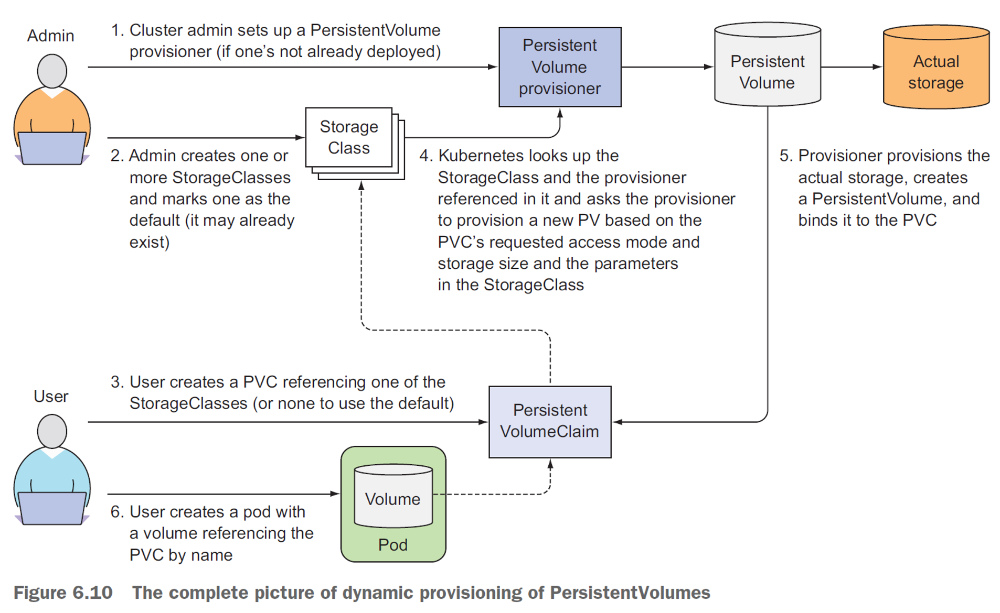
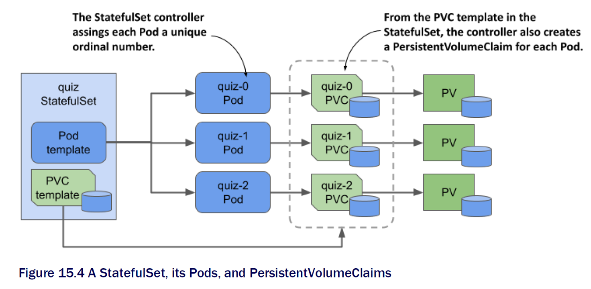

## NVSHAS-8534 - To block the usage of specific storage classes

## Table of Contents

- [Section 1: Background](#section-1-background)
- [Section 2: Admission Controller behavior](#section-3-admission-controller-behavior)
- [Section 3: Proposal plan](#section-3-proposal-plan)
- [Section 4: References](#section-4-references)

## Section 1: Background

[Case description](https://jira.suse.com/browse/NVSHAS-8534?filter=-1)

> Can we block the usage of specific storage classes with NeuVector? Maybe with Admission Controls?
> There are some predefined storage classes that users should not use; they need to be blocked.

**Challenge**  
This case presents additional challenges compared to other criteria due to the following characteristics:

- Storage classes are not directly embedded in the workload manifests.
- Workload manifests utilize PVCs, which are independent resources. They can be created either before or after the workload creation.
- Kubernetes will not request re-validation when a pending pod transitions to the running state.

Here is an example to show the relationship:

<p align="left">

</p>

## Section 2: Admission Controller behavior

Workloads and PVCs are distinct resources that can be created independently. If a workload is created before a PVC, the associated pod will remain in a Pending status until the PVC is ready.

However, in this scenario, Kubernetes will not notify the Admission Controller for validation, nor will any create or update events be triggered. Consequently, there is no opportunity to validate the content of the PVC.

This presents a challenge for us as we aim to restrict the creation of the workload.

This behavior has been tested on Kubernetes versions 1.21, v1.28, and v1.29.

## Section 3: Proposal plan

The objective here is to prevent the usage of storageClassName in the workload, aligning with current UI design for a more intuitive experience.
In the current UI design, all rules are directed towards workload resources.

To achieve this, we add a new criteria, "storage classname".

Depending on the sequence of resource creation, we will manage it as follows:

**Case 1: the PVC resource exist when workload AdmissionReview comes in**  
In this case, we will retrieve the PVC resource from the API server and proceed with the validation process. We will be able to make a decision at this stage. The resource being blocked will be the workload resource, such as a deployment.  
This is a happy case.

**Case 2: the PVC resource does not exist when workload AdmissionReview comes in**  
In this scenario, we are unable to reach a final decision due to the unavailability of the PVC resource. We will record this workload information, capturing its PVC name and namespace. Consequently, we will return `pass` to Kubernetes as the validation outcome. The deployment will start, but the pod will remain in a pending state (because its PVC is not yet ready.).

Upon receiving a request for PVC resource validation, we will cross-reference it with recorded data. If a match is found, we will prohibit the creation of the PVC. This will make the workload remain in a pending state.

The resource being blocked will be the PVC resource.

In both case 1 and case 2, the affected workload will not start in the end. However, the blocked resource will differ between the two cases.

?? what's the behavior if the Rule does not contain namespace criteria

### UI - Add a criterial named "StorageClassName"

<p align="left">

</p>

<p align="left">

</p>

## Section 4: References

**Dynamic provisioing flow**

<p align="left">

</p>

**PVC Template in StatefulSets**

<p align="left">

</p>

**Workload creation**

```
neuvector@ubuntu2204-A:~/temp$ kubectl apply -f deploy.yaml
deployment.apps/my-dep created

neuvector@ubuntu2204-A:~/temp$ kubectl get deploy my-dep
NAME     READY   UP-TO-DATE   AVAILABLE   AGE
my-dep   0/1     1            0           16s

neuvector@ubuntu2204-A:~/temp$ kubectl get pod
NAME                                               READY   STATUS    RESTARTS      AGE
my-dep-84b7cf5584-jp84g                            0/1     Pending   0             30s

neuvector@ubuntu2204-A:~/temp$ kubectl describe pod my-dep-84b7cf5584-jp84g
Status:         Pending
Containers:
  nginx:
    Image:        nginx
    Mounts:
      /usr/share/nginx/html from task-pv-storage (rw)
      /var/run/secrets/kubernetes.io/serviceaccount from kube-api-access-v657h (ro)

Events:
  Type     Reason            Age   From               Message
  ----     ------            ----  ----               -------
  Warning  FailedScheduling  40s   default-scheduler  0/3 nodes are available: 3 persistentvolumeclaim "task-pv-claim" not found.
```

**Create dependent PVC**

```
neuvector@ubuntu2204-A:~/temp$ kubectl apply -f pvc.yaml
persistentvolumeclaim/task-pv-claim created
neuvector@ubuntu2204-A:~/temp$ kubectl apply -f pv.yaml
persistentvolume/task-pv-volume created

neuvector@ubuntu2204-A:~/temp$ kubectl get pods
NAME                                               READY   STATUS    RESTARTS      AGE
my-dep-84b7cf5584-jp84g                            1/1     Running   0             3m47s
```
