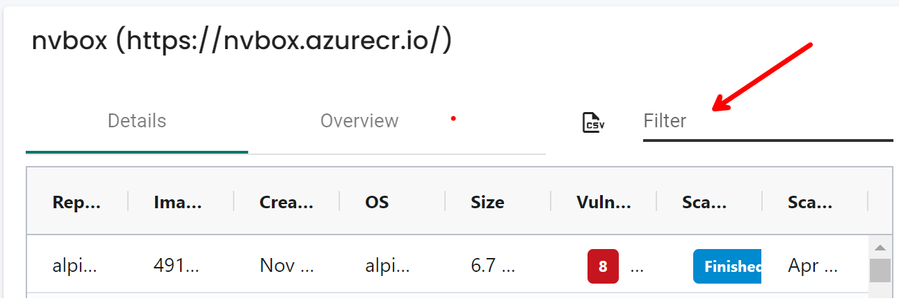

## asset pagination support (v5.3.3)

### History

- v1 - 2024/04/10
- v2 - 2024/04/23 (testing environment with working build is ready)
- v3 - 2024/05/01 (adjust data structure)

## Table of Contents

- [Background](#background)
- [Starting a Query Session](#starting-a-query-session)
- [Navigating Within a Query Session](#navigating-within-a-query-session)
- [Testing Environment](#testing-environment)

### Background

[NVSHAS-8857](https://jira.suse.com/browse/NVSHAS-8857?filter=-1)
REST API support for adding pagination and some image informations

### Starting a Query Session

To initiate a query, use the POST method on the endpoint `/v1/scan/asset/view/asset`, providing filters and sorting options within the request body.

> [!NOTE]
> The API name will be changed later.

**Request Body**

```
POST /v1/scan/asset/view/asset

Request Body
{
    type='image'    // in v5.3.3, only image is supported
}
```

**Response Body**

```
{
    "debug_perf_stats": [
      ...
    ],
    "query_token": "b1315231c773",  👈  // need to bring this value in the URL parameter to navigate this query session
    "summary": {
        "top_images": [
            {
                "display_name": "wurstmeister-zookeeper:latest",
                "high": 1385,
                "id": "dc00f1198a444104617989bde31132c22d7527c65e825b9de4bbe6313f22637f",
                "medium": 1009
            },
            {
                "display_name": "citadel:1.4.2",
                "high": 1051,
                "id": "9a48168d5ab29a332e14541be713b0be76f330c035f2dfbf115f2583c74edd33",
                "medium": 1148
            },
            {
                "display_name": "node-istio:latest",
                "high": 1344,
                "id": "21192ddd0a012fe978d28106c80be49b9a7bfec6c394e7036bbf3ea0286bfd3a",
                "medium": 845
            },
            {
                "display_name": "selvam_centos_http:latest",
                "high": 494,
                "id": "2fa01e609a4f5b9ee0b6af7711e582fa0a423c213f5ff9fcd63b5589f3ae8c4d",
                "medium": 779
            },
            {
                "display_name": "alpinedev:20230519-110159",
                "high": 111,
                "id": "53b0e93618b3cebff066a17d275b6017b4b9a3514437747326cc35dc4c44f4a7",
                "medium": 30
            },
            {
                "display_name": "others",     // 👈 ** the 6th record is for other which is sum of all the remainings
                "high": 21462,
                "id": "",
                "low": 1390,
                "medium": 16689
            }
        ]
    },
    "total_records": 4888
}
```

### Navigating Within a Query Session

To navigate within an existing search session, make an `HTTP GET` request to the same endpoint with the following query parameters.

Refer to the detailed fields and their corresponding values in the following raw data section.

If the user opts for a different column sorting, we can incorporate this change within the current query session by adding the `orderbyColumn` and `orderby` URL parameters, eliminating the need to create a new query session and thereby enhancing performance.

**Request**

```
GET /v1/scan/asset/view/asset?token=eff501a8ce17&start=0&row=100

1️⃣ token: Indicates the query session; you can find this token in the response body.
2️⃣ start: Specifies the starting row.
3️⃣ row: Defines the number of rows to fetch. Use -1 to fetch all rows.
4️⃣ orderbyColumn: Use different column to sort.
    Available columns are `repository` (default), `imageid`, `createdat`, `os`, `size`, `scannedat`
5️⃣ orderby: Use different sort type. Available options are `asc`, `desc` (default)
6️⃣ qf: quick filter search term.
    The search scope is currently limited to following columns `repository`, `imageid`, `os`, `createdat` and `scannedat`
```

**Reponse**

```
Overall structure

    {
        "data": [{..},{..}],
        "type": "image"
        "qf_matched_records": 0, // 👈 how many quick filter matched records
    }

For type image, the detail field in data array are:

   {
      "base_os": "ubuntu:14.04",
      "created_at": "2016-01-21T07:57:36Z",
      "digest": "sha256:b5e6403464bcc29c6424a66d91c4a54b86804a0f6bf014621c758e71775b7a42",
      "high": 1384,
      "image_id": "dc00f1198a444104617989bde31132c22d7527c65e825b9de4bbe6313f22637f",
      "low": 69,
      "medium": 1016,
      "name": "wurstmeister-zookeeper:latest",
      "repo_url": "https://nvbox.azurecr.io/wurstmeister-zookeeper:latest",
      "repository": "nvbox",
      "scanned_at": "2024-05-02T00:11:19Z",
      "size": 468694951,
      "tag": "latest"
    },
```

Quick filter:

<p align="left">

</p>

## Testing environment

I have set up an environment in the lab at `10.1.45.44`

To access the management console, visit https://10.1.45.44:30590/#/login.
If necessary, you can also SSH into the machine to make any required changes.
The controller endpoint is accessible via curl at `10.1.45.44:31693`

```
neuvector@ubuntu2204-E:~/ui_perf/asset$ echo $K8sNodeIP:$ControllerSvcPORT
10.1.45.44:31693
```

You can also following scripts for testing.

**Create a query session**

```
// request
curl -X POST -k -H "Content-Type: application/json" -H "X-Auth-Apikey: test2:GVkVJkMkviLfmYJ+VCwu3wsY/GT8slPH2xwEdfFnT8w3PcX27SJoBCvzPrMYH0mP" -d @assetimage.json "https://$K8sNodeIP:$ControllerSvcPORT/v1/scan/asset/view/asset"

// response
{
    "debug_perf_stats": null,
    "query_token": "06346645480d",
    "summary": null,
    "total_matched_records": 0,
    "total_records": 26
}
```

**Navigate through a session**

```
curl -k -H "Content-Type: application/json" -H "X-Auth-Apikey: test2:GVkVJkMkviLfmYJ+VCwu3wsY/GT8slPH2xwEdfFnT8w3PcX27SJoBCvzPrMYH0mP" "https://$K8sNodeIP:$ControllerSvcPORT/v1/scan/asset/view/asset?token=06346645480d&debug=1&row=-1&start=0&orderbyColumn=repository&orderby=desc&qf=alpine"
```
