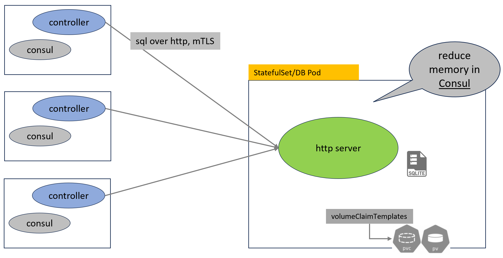
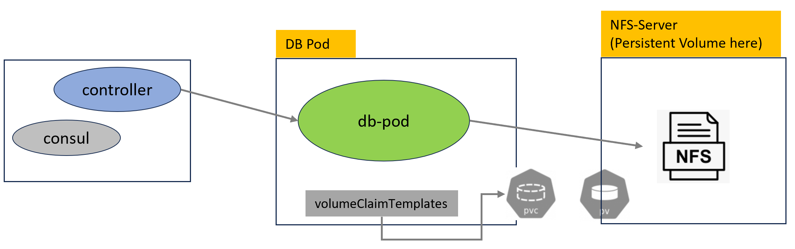

# NV db-pod for v5.4

## History

- v1 - 2024/05/20

## Table of Contents

- [Background](#background)
- [Design](#design)
- [Discussion](#discussion)

## Background

In version 5.4, we will introduce a database pod, which functions as a database service within the NeuVector deployment. This feature is optional and can be deployed by users at their discretion.

TODO: mention if user do not have memory pressure in their environment, they don't need to enable while upgrade to v5.4.

// what we will store in db-pod
When activated, it will store scan report in the database pod rather than Consul, thereby reducing memory usage in Consul. The data to be stored in the database pod will be scan report, including benchmark data.

Each scan report has two keys in Consul (1) state key and (2) data key
Only `data key` will be migrated.

```
state key => scan/state/report/workload/81712...
data key => scan/data/report/workload/81712...
```

The scan/state will still be stored in Consul, only the scan/data part will be stored in db-pod
The reason is the scan/state plays an important role in the Controller. We want to preserve it so the changes can be minimized.

This document describes the process of migrating pre-existing scan reports from Consul to the database pod.

<p align="center">

</p>

## Design

Following list some design for the db-pod:

TODO: mention it is just an HTTP server, using embedded dadatabase. And leverage k8's storage to persist data.

### 1️⃣ db-pod is a `StatefulSet` in Kubernetes within the same namespace with Controller

The db-pod is a `StatefulSet` in Kubernetes which user need to provide `storageClassName` value in the `volumeClaimTemplates`

```
neuvector@ubuntu2204-A:~$ kubectl get statefulset -n neuvector
NAME               READY   AGE
neuvector-db-pod   1/1     80d  👈👈

neuvector@ubuntu2204-A:~$ kubectl get pods -n neuvector
NAME                                         READY   STATUS      RESTARTS      AGE
neuvector-controller-pod-744c7d9684-jh4b4    1/1     Running     0             24h
neuvector-db-pod-0                           1/1     Running     0             29h   👈👈
neuvector-enforcer-pod-4ppbt                 1/1     Running     4 (29d ago)   99d

neuvector@ubuntu2204-A:~$ kubectl get pvc -n neuvector
NAME                           STATUS   VOLUME                                     CAPACITY   ACCESS MODES   STORAGECLASS   AGE
nvdb-file-neuvector-db-pod-0   Bound    pvc-90914783-f893-4fa5-8e8f-c4cd2e693f89   5Gi        RWO            nfs-client     80d
```

### 2️⃣ SQL over HTTP

reduce the Controller pod and db-pod dependency. db-pod currnetly server as a database service which accept SQL statement. This eliminate the dependency when we need to adjust schema. The logic can be done purely on Controller side.
On db-pod, it server three endpoints /execute, /query/

### 3️⃣ Authentication

Using Mutual TLS (mTLS) for authentication, and only Controller can access db-pod.

It will use same certificate rotation mechanism in v5.4.

### 4️⃣ Migration

When user migrate to v5.4 with db-pod enabled, we want to migrate existing data stored in Consul.
The goal we want to achieve is if DB pod is installed, at a moment during upgrade, the migration happens automatically.

## Migration existing data from Consul to db-pod

**Mechanism**  
A scheduler routine within the `lead Controller` will commence every XX minutes to execute the migration process. Migration will only proceed when all Controllers are operating on the same supported version (e.g., v5.4).

Upon execution, following routines will be performed.

1. Enumerate all scan report pairs from Consul (scan/state and scan/data).
2. Write the scan/data part to the db-pod. It's a HTTP call which wrap SQL statement to db-pod.
3. Delete the scan/data from Consul.

The migration process can be interrupted (e.g., during a Controller pod restart). The scheduler routine will be invoked regularly (interval TBD, possibly every xx minutes). This aligns with the nature of Kubernetes, where pods are replaceable and can be down at any time. This mechanism ensures that data can be migrated successfully.

Therefore, the migration process is continuous rather than a one-time task.

Consider a scenario where a network-mounted drive, such as an NFS server, is unavailable. In this case, the Controller will not be able to save data to the db-pod. Instead, the Controller can store the data in Consul first. Continuous migration can help in this scenario, adding more resilience to NeuVector.

The GetScanReport() function will be adjusted to retrieve data from the db-pod. If the db-pod is unavailable, it will read from Consul instead.

**Performance:**

| Scan Report count | CVE Size | Each Report Size | Total Time (migrate 1000 scan report) |
| ----------------- | -------- | ---------------- | ------------------------------------- |
| 1000              | 142      | 5KB in zip       | 13 seconds                            |
| 1000              | 1371     | 33KB in zip      | 17 seconds                            |

<p align="left">

</p>

## Discussion

1. How does a user enable the db-pod feature?
2. Does the existence of a db-pod imply automatic usage?
3. Can a user disable it if they change their mind?
